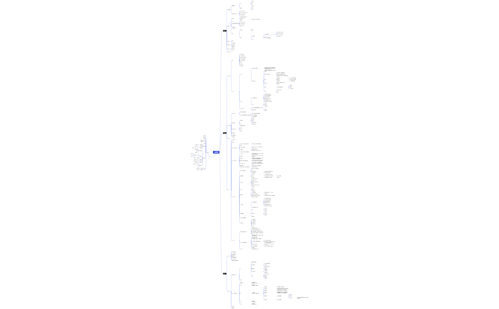
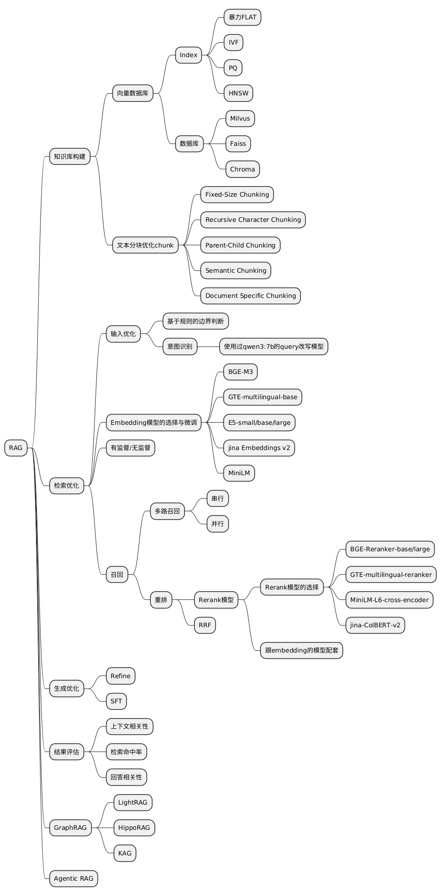

# 🤖 AI应用层

## 📊 思维导图

### 完整思维导图

### RAG

### Agent

### LLM

---

## 🔹 RAG

### 知识库构建

- **向量数据库**
  - Index
    - 暴力FLAT
    - IVF
    - PQ
    - HNSW
  - 数据库
    - Milvus
    - Faiss
    - Chroma
- **文本分块优化chunk**
  - Fixed-Size Chunking
  - Recursive Character Chunking
  - Parent-Child Chunking
  - Semantic Chunking
  - Document Specific Chunking
### 检索优化

- **输入优化**
  - 基于规则的边界判断
  - 意图识别
    - 使用过qwen3:7b的query改写模型
- **Embedding模型的选择与微调**
  - BGE-M3
  - GTE-multilingual-base
  - E5-small/base/large
  - jina Embeddings v2
  - MiniLM
- **有监督/无监督**
- **召回**
  - 多路召回
    - 串行
    - 并行
  - 重排
    - Rerank模型
    - Rerank模型的选择
    - BGE-Reranker-base/large
    - GTE-multilingual-reranker
    - MiniLM-L6-cross-encoder
    - jina-ColBERT-v2
    - 跟embedding的模型配套
    - RRF
### 生成优化

- **Refine**
- **SFT**
### 结果评估

- **上下文相关性**
- **检索命中率**
- **回答相关性**
### GraphRAG

- **LightRAG**
- **HippoRAG**
- **KAG**
### Agentic RAG

## 🔹 Agent

### multi-agent

- **节点**
  - State状态定义
  - Planner 任务分解
  - Tools Selection 工具选择
  - Guardrails安全防护
  - Summarize 结果聚合
  - Memory
  - Validator
  - Final answer
  - 多工具工作流
- **memory**
  - mem0
    - 对话/会话/用户/通用记忆
    - 四层记忆不是孤立的，用户消息进入对话层后，其中偏好可以进入用户记忆，任务相关进入会话记忆，通用知识进入通用记忆
    - 记忆写入管线
    - 信息提取：从对话提取结构化事实，支持自定义提取规则
    - 核心价值：冲突解决
    - 检索现有记忆，检查重复和矛盾
    - 使用LLM进行语义级别的冲突检测
    - “最新的真相作为最终标准”，同时保留历史变更轨迹
    - 存储
    - 向量数据库
    - embedding语义相似度检索
    - 图数据库
    - 记忆之间的关系，关联推理
    - 元数据索引
    - user_id等精确过滤字段
    - 写入模式
    - 智能提取，自动提取事实，去重
    - 原样储存
    - 图记忆
    - 图记忆+向量检索的协同
    - 1.向量检索
    - 2.图遍历
    - 3.reranker重排
    - 核心APi
    - add/delete/update
    - search
    - Get all
  - claude
    - 上下文压缩的优先级
    - 非当前任务相关的文件内容
    - 命令输出（截断到关键信息）
    - 早期对话历史的摘要
    - 最近的对话历史（5-10）轮
    - 当前任务相关的文件内容
    - 系统提示+工具定义（不可压缩）
    - memory
    - 工作记忆
    - 项目记忆
    - 长期系统记忆
  - mini-code-agent
    - clip/middle配合的截断/省略机制，应对长记忆
    - 结构化的会话记忆
    - 工作记忆
    - 完整记录
### Code Agent

- **工作区上下文**
  - 通过git命令收集项目信息
  - clip与middle配合的截断机制，应对超长文本
    - 文件名：后面内容比前面内容重要
    - 日志：前面内容重要
    - xml等内容中间重要
- **提示词构建**
  - 系统提示词
    - 系统规则
    - 工具列表
    - 使用示例
    - git收集工作区信息
  - 记忆
    - 任务/文件/笔记
  - 本次对话的来回问答
- **工具定义与执行**
  - list_file
  - read_file
  - search
  - write_file
- **Memory**
- **上下文缩减**
- **会话记录与恢复**
- **子任务委托**
### Agentic Rl

### 范式

- **Deep Research**
- **Manus**
- **Openclaw**
- **Kimi K2.5 Agent Swarm**
  - Agent as tools(subagent之间无交互)
    - 不同于langgraph条件边/有向图的模式
  - 并行执行
  - orchestrator协调者
    - 相比于子agent,多了create-subagent和assign-task
  - PARl强化学习
    - 鼓励模型并发调度agent
    - 子任务是否完成，防止无意义subagent
  - subagent不由人为创建，模型来创建
- **Harness Engineering**
  - 上下文工程
    - 渐进式披露思想的进一步优化，把agent.md当成文件导航，存放文件链接
  - 架构约束
    - Types-Config-Repo-Service-Runtime-UI代码只能向前依赖
  - 垃圾回收
    - 定期运行扫描agent,重构偏离标准的代码。对抗代码的熵增（所有大型代码库的痛点）
  - 进度文件，解决忘记进度的问题
    - claude-progress.txt不止是日志，每个新对话的第一件事：读进度文件+git log,从断电继续
  - trace analyzer skill
    - 从langsmith获取上一轮运行的追踪数据，对harness修改，通过harness的思想迭代harness的实施
  - 强制测试闭环
    - 写完代码不允许停止，必须跑测试验证
  - 核心思想：约束多，agent自主性反而多
    - 高速公路上才敢开120码
- **'open' claude**
  - Query Engine推理中枢
    - 如何在长上下文高效分配token
    - CoT
    - 上下文窗口管理
    - 如何裁剪，压缩和优先级排序上下文
    - 查询规划与执行
    - 将用户请求分解为子任务
  - 多智能体编排
    - coordinator
    - 上下文完全隔离，子agent不通信
    - 串行fork
    - 子任务上下文独立，解决上下文污染
    - 父子agent间通信
    - 并发swarm
    - 主进程可唤醒多个agent并行执行
    - 支持通信
  - Tool System
    - 文件操作Read,Write,Edit
    - 命令执行 Bash
    - 搜索工具 Grep Glob Search
    - IDE集成
    - 网络工具 WebFetch WebSearch
    - MCP协议
  - memory
    - 工作记忆
    - 项目记忆
    - 长期系统记忆
  - 权限管理
    - 第一层规则匹配
    - 简单的字符串匹配（rm -rf，git push ）
    - 第二层 bash命令分类器
    - 常见危险命令
    - 第三层 基于当前对话上下文来判定
    - 分析操作的上下文意图，结合历史的操作记录
    - 第四层 Claude api来判定
  - 上下文管理
    - 上下文压缩的优先级
    - 非当前任务相关的文件内容
    - 命令输出（截断到关键信息）
    - 早期对话历史的摘要
    - 最近的对话历史（5-10）轮
    - 当前任务相关的文件内容
    - 系统提示+工具定义（不可压缩）
    - 只有成功的变更才写入记忆
  - token预算管理
    - 固定
    - 系统提示
    - 工具定义
    - 动态分配
    - 对话历史
    - 文件内容
    - 命令输出
    - 预留缓冲
  - search/replace编辑模式
  - prompt组装
    - system硬编码
    - mode每次切换
    - tools动态加载
    - 项目级持久记忆
    - git
    - 对话历史
- **MCP --> CLI**
  - MCP提供全部工具的描述
    - 参数等完整信息全部注入上下文
    - 用户下达的指令通常只需要2-3个工具
    - 不符合渐进式披露，token成本增加，信息冗余
    - MCP工具之间无法直接通信，比如A的输出作为B输入
    - MCP部署包括工具注册中心，身份认证，日志聚合等，DevOps负担
  - CLI--help原生的渐进式披露
    - 模型只查看自己需要的
    - 互联网海量的CLI命令语料，大模型熟悉
    - 与skills搭配，实现双重渐进式披露
    - skills的description是第一层
    - 把cli命令再分类，比如知识库目录相关，归为一类，实现第二层渐进式披露
    - 可组合性，Unix管道
    - find . -name '*.py' -mtime -7 | xargs grep 'FIXME' | wc -l
    - exit code精准判断错误
    - 0=成功，1=通用错误，126=权限不足
    - 零运维成本
  - MCP+CLi
    - 严格输入输出的工具：MCP
## 🔹 LLM

### pre-train

- **KV cache优化**
- **attention计算优化**
- **参数计算稀疏化**
- **推理机制优化**
- **绝对/相对位置编码**
- **上下文扩展方法**
- **多模态/时间对齐位置编码**
### post-train

- **热启动的post-train**
  - SFT
    - 数据加载与预处理
    - 提示格式化
    - 提示词与回答的张量化
    - label Shift
    - 填充掩码，损失掩码
    - 批量推理
    - 梯度累积
    - 梯度检查点
    - entropy监控
    - 全局有效熵
    - 响应内容熵
    - 评测
    - zero-shot baseline
    - 格式奖励
    - 答案奖励
    - 准确率统计
  - GRPO
  - DPO
- **RL-->RLHF算法演变**
  - 梯度策略
    - 直接优化策略 训练信号抖，更新不稳
  - TRPO
    - 信任域约束 防止更新过猛，过程复杂
  - PPO
    - TRPO 简化版 clip 稳定训练，过程还是复杂
    - 策略模型
    - 待优化的模型，参与参数更新
    - 价值模型
    - 计算当前动作和状态的期望回报，可由奖励模型或策略模型初始化而来，参与参数更细
    - 奖励模型
    - 计算当前动作的即时奖励，不参与参数更新
    - 参考模型
    - 由策略模型进行初始化，不参与参数更新，用于限制策略模型在优化时不偏离原始模型太远
    - 策略损失
    - 用于优化策略模型
    - 单步奖励
    - 累计奖励
    - 折扣奖励
    - 平衡即使奖励和长期奖励之间的关系，考虑未来的潜在奖励
    - 价值损失
    - 用于优化价值模型
  - DPO
    - 直接学偏好 不走 PPO 链路
  - GRPO
    - 组内相对优化 不依赖value model
- **Agentic RL**
- **推理部署**
